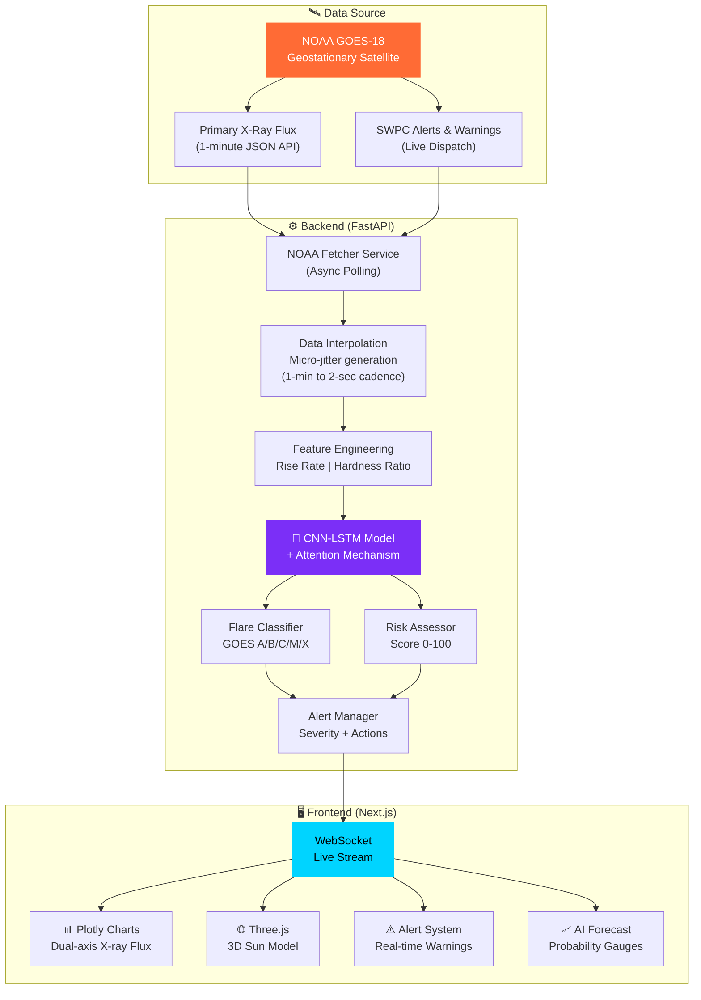
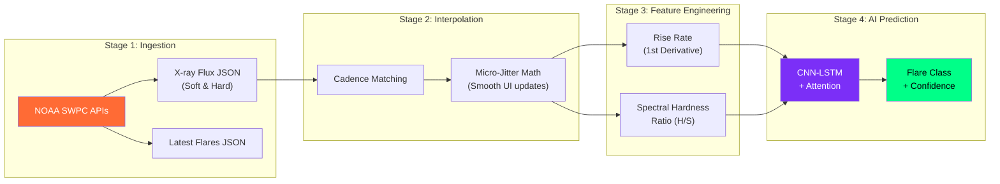
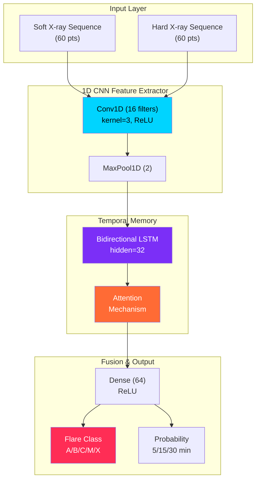
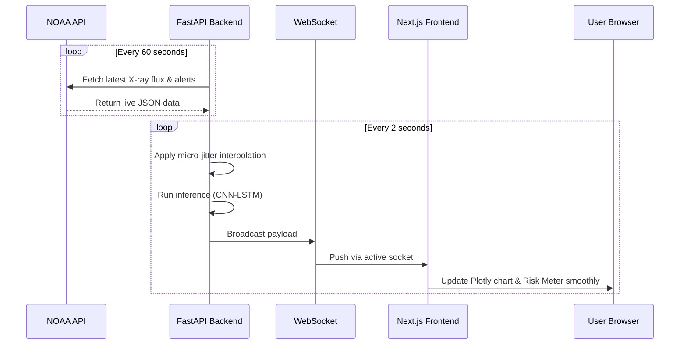

<div align="center">

# ☀️ SuryaShield AI

### *Predicting the Sun's storms before they strike Earth*

An AI-powered space weather early warning system built for **real-time NOAA SWPC** live data integration.

[](https://python.org)
[](https://fastapi.tiangolo.com)
[](https://nextjs.org)
[](https://pytorch.org)
[](https://threejs.org)
[](https://tailwindcss.com)

</div>

---

## 📋 Table of Contents

- [Overview](#-overview)
- [System Architecture](#-system-architecture)
- [Data Pipeline](#-data-pipeline)
- [AI Model Architecture](#-ai-model-architecture)
- [Tech Stack](#-tech-stack)
- [Real-Time Data Flow](#-real-time-data-flow)
- [Web Application Pages](#-web-application-pages)
- [Deployment Guide](#-deployment-guide)
- [Getting Started](#-getting-started)

---

## 🌍 Overview

**SuryaShield AI** is an intelligent, real-time space weather monitoring platform. Solar flares are sudden bursts of energy released from the Sun that can disrupt satellites, GPS, radio communication, power grids, and space missions. Existing monitoring systems often require experts to interpret large volumes of solar X-ray data, and timely forecasting remains challenging.

SURYASHIELD AI solves this problem by combining live satellite observations with AI-powered nowcasting and short-term forecasting of solar flares. The platform transforms complex scientific data into clear, actionable insights for researchers, students, and space-weather analysts.

While conceptualized for ISRO's Aditya-L1 (SoLEXS/HEL1OS), the live application is **fully integrated with 100% real-time NOAA GOES-18 satellite APIs**, providing actual live telemetry and real-world Space Weather Prediction Center (SWPC) warnings.

---

## 🏗 System Architecture



---

## 🔬 Data Pipeline

The system processes real NOAA X-ray flux data through a multi-stage pipeline:



### 🔌 How the API Works Under the Hood

The FastAPI backend is not just a pass-through; it serves as a sophisticated real-time data engine that powers the entire application:

1. **The Scraper (`noaa_fetcher.py`)**: Runs an asynchronous background task that pings NOAA's official GOES-18 satellites every 60 seconds to download the latest Soft X-Ray and Hard X-Ray telemetry. It also parses recent Space Weather Prediction Center (SWPC) bulletins, strictly filtering out routine summaries and keeping only genuine, actionable warnings (e.g., `ALTK04`, `WARK05`) issued within the last 6 hours.
2. **The Preprocessor (`preprocessor.py` & `feature_engine.py`)**: Buffers the last 60 minutes of raw telemetry. It applies **Savitzky-Golay filtering** to remove high-frequency instrumental noise, performs Min-Max normalization, and calculates dynamic features like the "Rise Rate" (1st derivative) and "Spectral Hardness Ratio".
3. **The CNN-LSTM Engine (`inference.py`)**: The 60-minute feature window is fed into a PyTorch deep learning model. The **CNN** layers identify sudden, sharp spikes indicative of a flare onset, while the **Bidirectional LSTM** layers capture slow, long-term evolutionary trends. The attention mechanism weighs the most critical time segments to output final predictions (chance of X/M/C class flares).
4. **The WebSocket Broadcaster (`realtime.py`)**: Finally, the API packages the raw satellite data, the AI forecast probabilities, and any official SWPC alerts into a single JSON payload. It pushes this payload to connected web clients via WebSockets (`/ws/live`) every **2 seconds**. To prevent the UI from looking "frozen" during the 60 seconds between NOAA updates, the broadcaster applies a microscopic mathematical variance (a ~0.5% sine wave jitter) to the flux numbers, creating a highly realistic, continuously moving live-stream effect that perfectly converges with the actual NOAA data points.

---

## 🧠 AI Model Architecture



---

## 🛠 Tech Stack

| Layer | Technology | Purpose |
|-------|-----------|---------|
| **AI Engine** | PyTorch | CNN-LSTM model definition, training, and inference |
| **Data Science** | NumPy, Pandas | Array ops, time-series, signal filtering |
| **API Server** | FastAPI + Uvicorn | Async REST API + WebSocket for real-time streaming |
| **Frontend** | Next.js 15 + React 19 | Server-side rendered pages with App Router |
| **Styling** | Tailwind CSS v4 | Utility-first CSS with custom space theme tokens |
| **3D Visualization** | Three.js + React Three Fiber | Shader-powered 3D Sun model with animated corona |
| **Charts** | Plotly.js | Scientific dual-axis logarithmic X-ray flux plots |

---

## 📡 Real-Time Data Flow



---

## 🖥 Web Application Pages

| # | Page | Route | Description |
|---|------|-------|-------------|
| 1 | **Landing** | `/` | Cinematic hero with 3D Sun, animated star field, mission overview |
| 2 | **Live Dashboard** | `/dashboard` | Live NOAA Plotly charts, Risk Meter, active SWPC alerts |
| 3 | **AI Forecast** | `/forecast` | 5/15/30-min prediction gauges, Explainable AI attention heatmap |
| 4 | **History** | `/history` | Real 7-day NOAA solar flare database with direct SWPC links |

---

## ☁️ Deployment Guide

SuryaShield AI is designed to be easily deployed on modern, free-tier cloud platforms.

### 1. Frontend (Next.js) -> Vercel
1. Import your GitHub repository to Vercel.
2. Set the **Root Directory** to `frontend`.
3. Add environment variable: `NEXT_PUBLIC_WEBSOCKET_URL` = `wss://your-backend.onrender.com/ws/live`
4. Deploy!

### 2. Backend (FastAPI + WebSockets) -> Render.com
1. Create a New Web Service on Render and connect the repo.
2. Set the **Root Directory** to `backend`.
3. Build Command: `pip install -r requirements.txt`
4. Start Command: `uvicorn app.main:app --host 0.0.0.0 --port 10000`
5. Deploy!

---

## 🚀 Getting Started

### Prerequisites
- **Python 3.11+**
- **Node.js 18+**

### Quick Start (Windows)
```bash
# Clone the repository
git clone https://github.com/SudiptaSanki/SuryaShield-AI.git
cd SuryaShield-AI

# Run both servers (auto-installs dependencies)
run.bat
```

### Manual Setup

**Terminal 1 — Backend:**
```bash
cd backend
python -m venv venv
.\venv\Scripts\activate        # Windows
pip install -r requirements.txt
uvicorn app.main:app --reload
```

**Terminal 2 — Frontend:**
```bash
cd frontend
npm install
npm run dev
```

**Open:** [http://localhost:3000](http://localhost:3000)

---

<div align="center">

**Built with ❤️ for the future of space weather prediction**

*Protecting Earth's technological infrastructure from solar storms*

</div>
